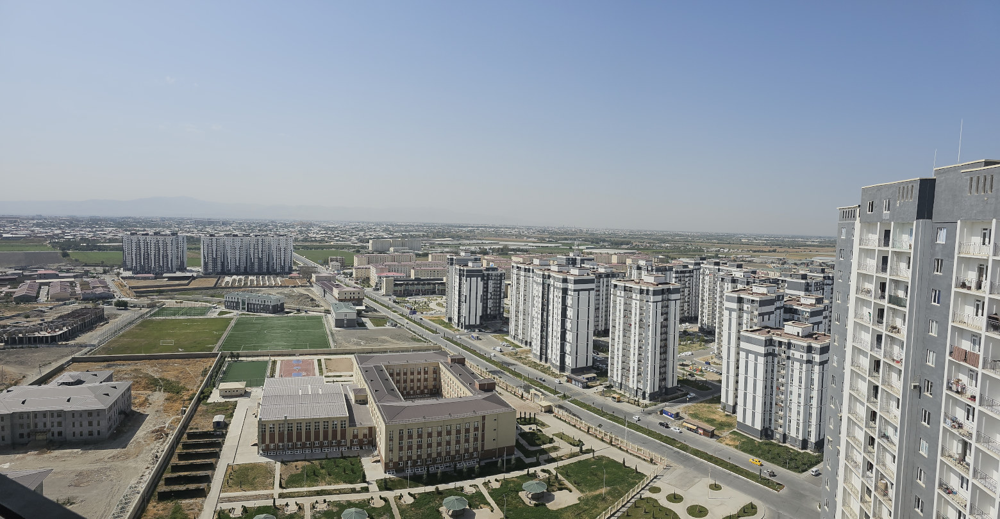

<head>
  <title>Районы Самарканда</title>
  <meta property="og:title" content="Районы Самарканда" />
</head>

В Самарканде нет официального деления на районы, поэтому названия народные и
четких границ нет. [Подробнее о топонимах](../samarkand/toponyms.md). В целом, в
Самарканде нет однозначно нежелательных районов, у каждого свои плюсы и минусы.

Самое интересное, что районы стабильно уступающие другим в качестве коммунальных
услуг могут неожиданно хорошо показать себя в лютый мороз. Также стабильность
электро/газо/водоснабжения плавает от дома к дому. Так что все очень
относительно.

## Вокзал {#railway}

На мой взгляд, это золотая середина по многим критериям.

- Отличная инфраструктура
- Вода без перебоев
- Один из самых стабильных районов в плане коммунальных услуг. Но встречаются и
  неудачные дома.
- Стабильное давление газа в большинстве домов
- Средняя цена аренды
- Не сильно далеко от центра
- Большой рынок
- Парк аттракционов

## Гагарина {#gagarina}

Недалеко от центра, вокруг максимальная концентрация различных заведений.

- Отличная инфраструктура
- Вода без перебоев
- Более-менее хорошо с электричеством
- Центр недалеко, но аренда уже дешевле
- Непрекращающийся ремонт дороги

## Бульвар {#boulevard}

Центр города, вся инфраструктура рядом. Лучшие заведения и места для прогулок.
Но и цены самые высокие

- Отличная инфраструктура
- Красиво, душевно
- Центральный парк
- Много студентов и иностранцев, что создаёт атмосферу "европейского" города

## Микрорайон {#mikrorayon}

- Отличная инфраструктура
- В некоторых домах вода по часам
- Перебои с электричеством средние
- Много кружков/секций для детей
- Очень много различных магазинов

## Мархабо {#marhabo}

- Вода по часам
- Относительно недорого
- Перебои с электричеством средние
- Все преимущества микрорайона, так как все это рядом

## Согдиана {#sogdiana}

- Крупный торговый центр
- Дешевая аренда
- С электричеством по-разному, где-то отключают редко, где-то почаще
- Так-же и с водой
- Подальше от центра
- Рядом неплохой бульвар

## Аэропорт/Геофизика/Боги Майдон {#airport}

Район, в котором преобладает частный сектор, но есть несколько многоэтажек.
Относительно средний район, в котором преобладает местный колорит.

- Удобная дорогая как до вокзала, так и до бульвара. Прямая магистраль без
  пробок.
- Есть хорошие новые многоэтажки вдоль дороги.
- Есть крупный недорогой супермаркет
  [Yuksalish](../purchases/grocery.md#mini-supermarket).
- Стабильное водоснабжение, газ и свет. Из-за низкой плотности многоэтажек,
  проблемы достаточно редко возникают.
- Есть нормальный городской автобус между аэропортом и вокзалом.
- Недалеко есть городище Афросиаб, где можно побегать или погулять в хорошую
  погоду. Но возле аэропорта прогулочных зон нет.
- Цены средние для многоэтажек. На частный сектор цены могут быть любые.
- Ближе 1,5км от аэропорта, нужно быть готовыми к тому, что взлёт самолётов
  хорошо слышно.
- Европейских ресторанов практически нет, но много хороших кафе с местной
  кухней.

## Мотрид/Карасу {#qorasuv}

 

Человейник на отшибе со слабой инфраструктурой. Пустые пространства и ветрено.
Но здесь одни из самых дешевых вариантов аренды. Кому-то нравится. К тому-же,
район быстро развивается и постепенно становится самодостаточным.

- Высокие (по местным меркам) новостройки
- Инфраструктуры минимум
- Далеко от центра (от 15 минут и 20,000UZS на такси по пустым дорогам)
- Во многих домах перебои с водой и электричеством, в тех что повыше - получше.
  Но на удивление, в морозы перебоев здесь было не так много как в других
  районах.
- Один из самых дешевых вариантов
- Уныленько
- Теме не менее, минимум для жизни вроде Корзинки, частного детского сада и
  вкусной пиццерии имеется.
- Огромная футбольная школа

## Саттепо {#sattepo}

- Дешевая аренда
- Перебои с электричеством
- Вода по часам
- Подальше от центра
- Уныленько

## Супер и Бам {#super}

Он же Суперфосфатный, он же Kimyogarlar. Поселок в пригороде, входящий в состав
Самарканда. БАМ - это крупный жилой массив внутри.

- Дешевая аренда
- Дешевые кафе вокруг
- Очень далеко от центра
- Район очень обжитой, все необходимое есть рядом.

## Старый город {#oldtown}

Район к югу от Регистана и к востоку от Бульвара. Считается самый классный район
для туристических целей и тех, кто хочет пожить в "настоящем" Самарканде.

- Все достопримечательности рядом. Много туристов и иностранцев.
- Район состоит практически полностью из частного сектора. Много переулков и
  атмосферных мест.
- Много парков в пешей дальности.
- Очень добрые соседи, готовые всегда помочь (в т.ч. делом) и дать совет.
- Качество коммуникаций очень сильно зависит от дома к дому. При выборе следует
  смотреть на общее состояние дома. Если стоят современные котлы\щитки, то
  скорее всего с коммуникациями мало проблем.
- Если селиться в глубине махалли, то такси будет достаточно долго к вам ехать
  по переулкам.
