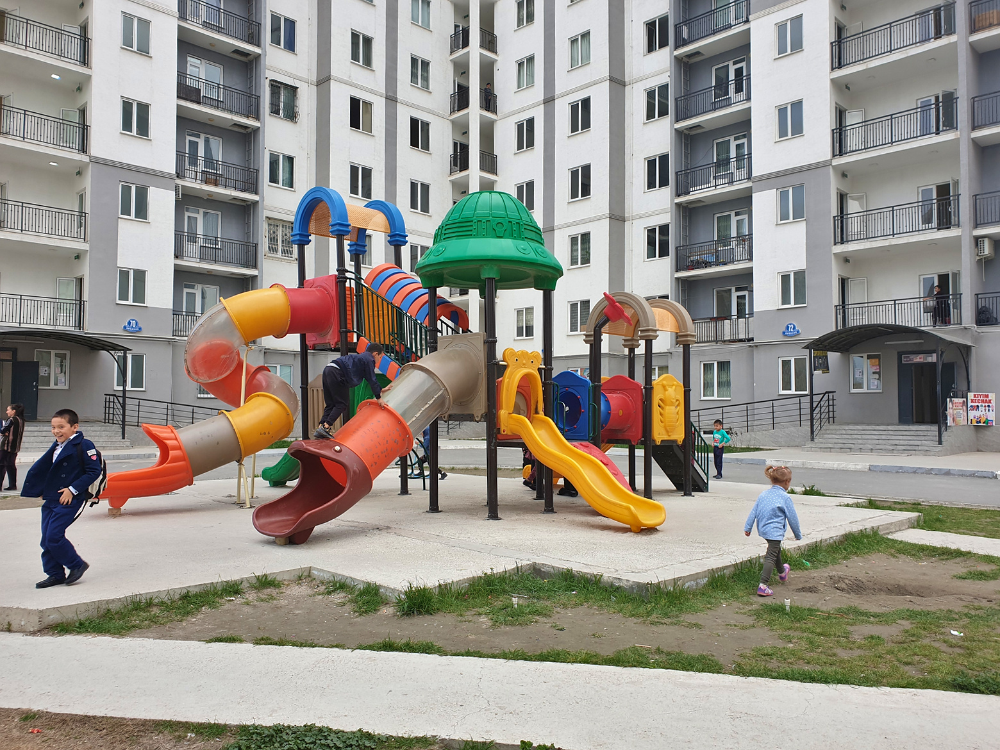

Узбекистан - одна из немногих постсоветских стран, где население не уменьшается,
а растет. Очень быстро. С 1991 года выросло более чем в полтора раза, до 36 млн
человек. Вообще, брак и дети для узбеков занимают важнейшее место в жизни. На
свадьбу копят много лет, задолго до выбора партнера. Невесту обычно выбирают
родители. Пригласить под тысячу гостей - нормальная практика. По традиции,
невеста переезжает в семью жениха. Первые несколько лет она перенимает опыт
семейного быта, потом молодая семья может начать жить отдельно, если есть
возможность. Дети появляются быстро, средний возраст первых родов - 23 года.

Во дворах не принято пристально присматривать за детьми. Бывает, на площадке
много детей разного возраста и ни одного взрослого. Старшие присматривают за
младшими. Когда наша дочка приходит на новую площадку, дети быстро включают ее в
свою игру. Не важно, говорят ли они по-русски или нет. За несколько месяцев я ни
разу не сталкивался с агрессией среди детей, хотя дома это было обычным
явлением.

