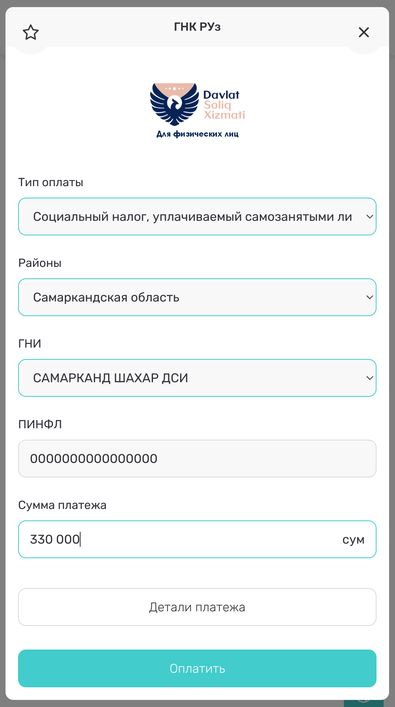

# Работа и бизнес

Мало кого посещала мысль уехать в Узбекистан, чтобы устроиться на работу.
Особенно не в столицу. Если в Ташкенте еще можно найти позицию с окладом в
$3000+ в сфере IT, то в Самарканде, наверное, даже пытаться не стоит. Тем не
менее времена меняются. Зарплаты постепенно растут. Кто-то перевозит сюда целые
компании, так что чем дальше, тем больше будет интересных вакансий.

Среди второй волны релокантов достаточно много людей для которых удаленная
работа не подходит. Кто-то смог достаточно быстро найти в городе интересную
вакансию. Сейчас огромный спрос на преподавателей (особенно русского), докторов,
фармацевтов. Где можно поискать работу:

- [icon-web samarkand.hh.uz](https://samarkand.hh.uz/)
- [icon-telegram SAMARKAND ISH](https://t.me/samarqand_rabota_ish)
- [icon-telegram Работа в Самарканде](https://t.me/samarkandvakansiya)
- [icon-telegram SamCityJobs](https://t.me/samcityjobs)
- [icon-web olx](https://www.olx.uz/d/rabota/samarkand/)
- [icon-telegram Relocationuz - Вакансии](https://t.me/+XfqwsMFvUBtlNzEy)
- [icon-telegram Relocationuz - Резюме](https://t.me/+mxhNi7eV-D41YmRi)

Для тех кто предпочитает фриланс и удаленку есть два варианта: самозанятость и
ИП.

У ИП Налоговая ставка зависит от дохода. До 100,000,000UZS в год платится только
фиксированный налог (примерно 250,000UZS в месяц) в зависимости от региона.
Далее, до 1,000,000,000UZS придется отдать 4% с оборота. А дальше уже условия
как у ООО. [icon-telegram Чат про ИП](https://t.me/YATT_UZ).

C ООО есть местные особенности. По умолчанию, условия сильно хуже чем в
республиках южного Кавказа. Но упускать зарубежных инвесторов не хочется, а
реформы проводить долго. Поэтому правительство придумало IT-Park. Его резиденты
вместо разных налогов платят 1% с оборота и 7.5% НДФЛ, а также получают приятные
бонусы вроде IT-визы для сотрудников на 3 года. Благодаря прямым контактам в
правительстве помогают решить многие проблемы без лишней бюрократии.

## Самозанятость {#self-employment}

До недавнего времени, информация по самозанятости была противоречива. То
проскакивала новость о том что нерезидентам доступен этот режим, то другая
новость — что запретили. На начало 2023 скопилось уже достаточно много успешных
кейсов, так что сейчас можно уверенно сказать что нерезидент может
зарегистрироваться в качестве самозанятого.

Самозанятые не платят никаких налогов при годовом доходе до 100,000,000UZS,
кроме ежегодного _добровольного_ социального взноса в размере 1БРВ, который
оплачивается в приложении Soliq, Click или PayMe. Фактически, это отчисления в
пенсионный фонд. Самозанятые могут, в том числе, работать с иностранными
клиентами и получать платежи в валюте на обычный счет физ лица. Никакой
отчетности не нужно, но опять же, до 100,000,000UZS в год. Банки могут
потребовать документы, подтверждающие источник дохода (подписанный контракт,
инвойсы, акты и т.п.), особенно при международных платежах. Статус самозанятого
запрещает работать где-либо или быть ИП. Отменить статус можно в любое время
online. Официальную информацию о самозанятости и разрешенных видах деятельности
можно найти [на lex.uz](https://lex.uz/docs/4849605) и в упрощенном виде
[на soliq.uz](https://soliq.uz/press-services/news/show/na-chto-obratit-vnimanie-pri-registratsii-v-kachestve-samozanyatogo?lang=ru).
Еще [на yaran.uz](https://yaran.uz/samozanyatye-lica-v-2021g/) неплохая статья.

С 2024 [вводятся лимиты](https://www.spot.uz/ru/2024/04/24/self-employed/) на
прибыль самозанятого:

| Размер годовой прибыли | Налог                          | Отчетность                                                                      |
| ---------------------- | ------------------------------ | ------------------------------------------------------------------------------- |
| До 100,000,000UZS      | 0                              | Нет                                                                             |
| От 100,000,000UZS      | 2% (электонная коммерция) - 4% | Упрощенная, если выбрана уплата налога в фикисрованном размере, то не требуется |
| От 1,000,000,000UZS    | Налог на прибыль 15%           | Полная                                                                          |

Налог по повышенной ставке платится только с суммы превышающей лимит. После
1,000,000,000UZS становится выгоднее открыть ИП.

Хорошая новость в том, что на экспортеров услуг (в том числе фрилансеров) лимиты
не распространяются. Хотя официальной информации по этому поводу я не встречал.

Зарегистрироваться в качестве самозанятого можно:

- Через мобильное приложение Soliq (самый простой способ).
  [Android](https://play.google.com/store/apps/details?id=uz.soliq.mobile),
  [iOS](https://apps.apple.com/uz/app/soliq/id1518038410).

- Через сайт [my.soliq.uz](https://my.soliq.uz/main/?lang=ru), необходима
  [ЭЦП](../services/government.md#e-signature).

- Через [госуслуги](https://my.gov.uz/ru/service/491).

Для регистрации вам понадобится [ПИНФЛ](../services/government.md#pinfl) и
название махалли в которой ведете деятельность (или прописаны).

Добровольный социальный взнос в 1БРВ уплачивается до 1 декабря текущего года. У
меня не получилось оплатить через Soliq, только через PayMe. В платежах ищите
«ГНК РУз», выбираете «Социальный налог, уплачиваемый самозанятыми лицами», ГНИ:
«САМАРКАНД ШАХАР ДСИ».

В 2024 у меня так-же получилось оплатить через Click: Платежи → Налоги → Для
физических лиц → Соц. налог для самозанятых.

Убедиться, что платеж принят можно в
[Актах сверок ФЛ](https://my3.soliq.uz/remotes-services/kls/individual-act)
(нужен ЭЦП), появляется достаточно быстро.

Есть
[icon-telegram отдельный чат для самозанятых](https://t.me/self_employment_uz).

### Оплата налога самозанятого при превышении лимитов {#self-employment-tax}

[Из чата](https://t.me/c/1880763005/7117):

Речь о 4% налоге с оборота, если сумма за год превысила 100,000,000UZS.

1. Зарегистрировался как самозанятый через приложение Soliq.uz.

2. Получил ЭЦП через [e-imzo.soliq.uz](https://e-imzo.soliq.uz/) за 26500UZS.

3. В месяц достижения дохода 100,000,000UZS подал
   [Обращение о внесении изменений в автоматизированный отчет по налогу с оборота](https://my3.soliq.uz/remotes-services/tax-turnover/send-appeals)
   — cумма дохода, полученного в течение периода плательщиком подоходного налога
   в фиксированном размере. Подтверждающий документ — свидетельство о
   регистрации в качестве самозанятого.

4. Ежемесячно до 15 числа следующего месяца: Подать
   [Обращение о внесении изменений в автоматизированный отчет по налогу с оборота](https://my3.soliq.uz/remotes-services/tax-turnover/send-appeals)
   — Прочие доходы — указать полученную сумму.

5. Ежемесячно до 15 числа следующего месяца отправить
   [форму отчетности самозанятых лиц](https://my.soliq.uz/wefo4-clientui/catalog/ru/get/package_groups)
   — налог с оборота — подать отчет за месяц (все цифры встанут сами).

6. Оплатить налог через мобильное приложение Soliq или личный кабинет
   [my.soliq.uz](https://my.soliq.uz/main/?lang=ru).

Если не разберётесь, можно обратиться за помощью:

- +998 (90) 742-44-04 городская налоговая
- [1198](tel:1198) общий колл-центр

## Коворкинг {#coworking}

@@coworking?findBy=id

В IT-Park неплохой коворкинг за 20,000UZS в день

 

Также, некоторые заведения неплохо подходят для работы:

@@coworking?findBy=tag

Кроме того, общими усилиями собрали
[табличку заведений, подходящих для работы](https://docs.google.com/spreadsheets/d/1IWz5-XmvrCZNRc4jXp7Bm9ZA0JYWGPcFFAgN2wDXwQI/edit?usp=sharing).
