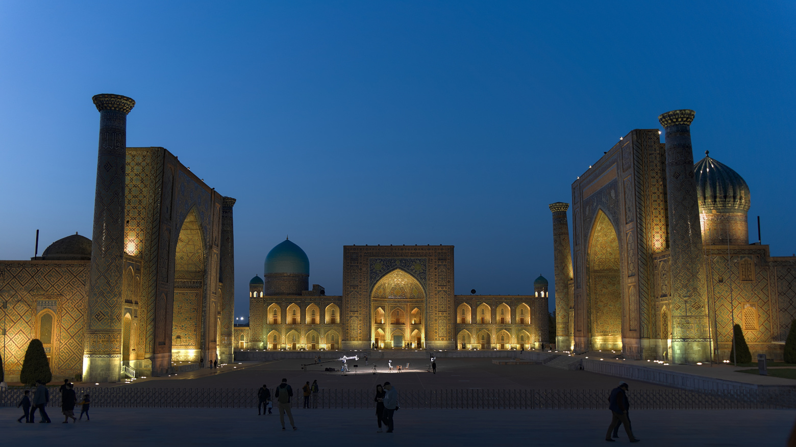
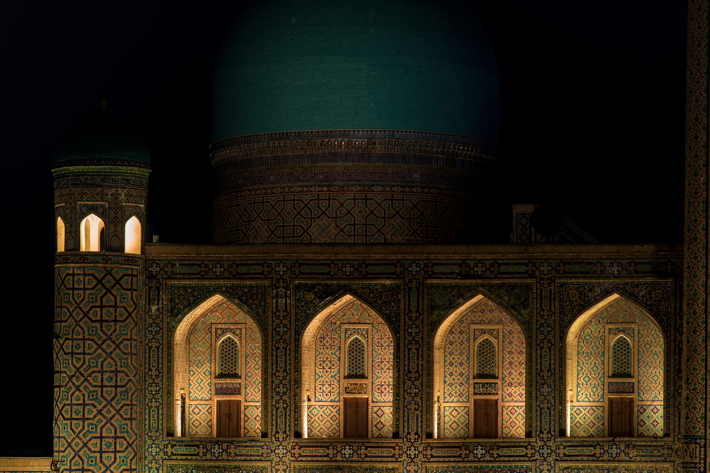
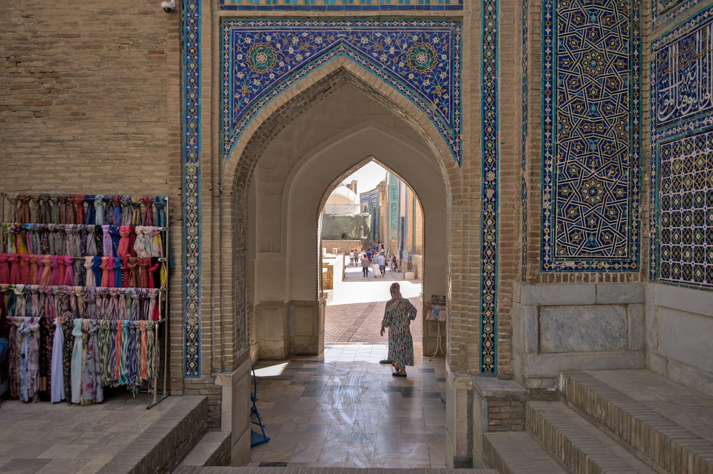

<head>
  <title>Самарканд и Узбекистан</title>
  <meta property="og:title" content="Самарканд и Узбекистан" />
</head>

Какие у вас ассоциации с Узбекистаном? Кто-то вспомнит узбекскую кухню с пловом,
мантами и лепешкой. Любители путешествий представят себе древние города и здания
с причудливыми узорами. И конечно, вспоминаются работящие парни из Средней Азии.
Но времена меняются, миграционные потоки тоже. Sad but true. И уже парни с
бледными лицами в обнимку с лэптопами уезжают в солнечный Узбекистан.

Ташкент всем хорош - интернет почти как дома, сервисы разнообразные, перелеты
прямые в разные уголки мира. Но хочется чего-то необычного.

Самарканд - центр притяжения туристов в Центральной Азии. Город появился аж в
VIII веке до н. э. За это время он успел несколько раз побывать столицей разных
стран, последний раз столицей Узбекистана в начале XX века. Не все его богатство
дожило до наших дней после многочисленных циклов строительства / тотального
уничтожения. Но после монголов он уже не подвергался такому кардинальному
рефакторингу. Примерно в 1370 Амир Тимур основал здесь великую империю, выбрав
Самарканд для строительства столицы. Учитывая, что в средние века исламский мир
был передовым в научном и техническом плане, можно сравнить размах со
строительством Нью-Йорка начала XX века. Многие архитектурные шедевры радуют
глаз и по сей день, пусть и в результате внушительной реставрации.

Но Самарканд это не только музей под открытым небом. Это еще и один из
крупнейших промышленных центров Узбекистана с населением более полумиллиона
человек. Поговаривают, скоро население превысит миллион после включения
ближайших населенных пунктов.

Может, лучше поддаться трендам и выбрать Батуми, Ереван, Стамбул или Тбилиси?
Тут каждый решает сам. Если сравнивать с популярными направлениями, то они до
сих пор сильно перегреты. Отсюда и цены на аренду почти как в Европе, и проблемы
с открытием счета. Ташкент уступает лидерам экспресс-миграции, но свежих
экспатов там в 30 раз больше чем в Самарканде. По сравнению с Ташкентом,
Самарканд заметно дешевле, тише. Многие отмечают что здесь народ гостеприимнее,
а в городе находиться приятнее.
