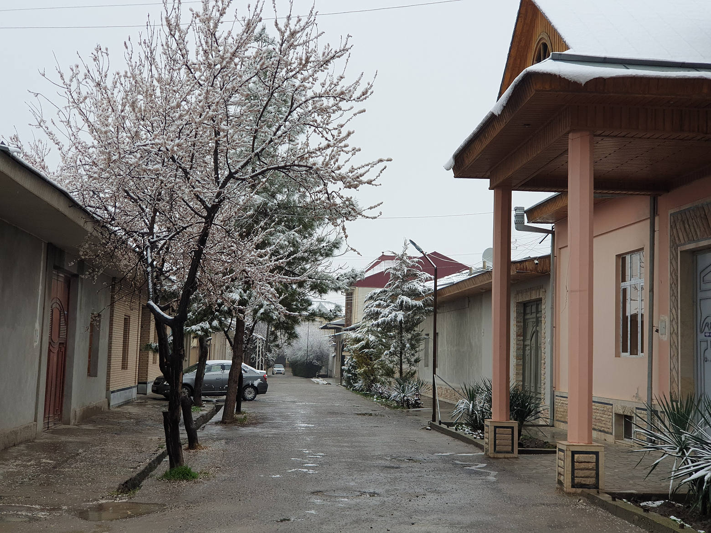
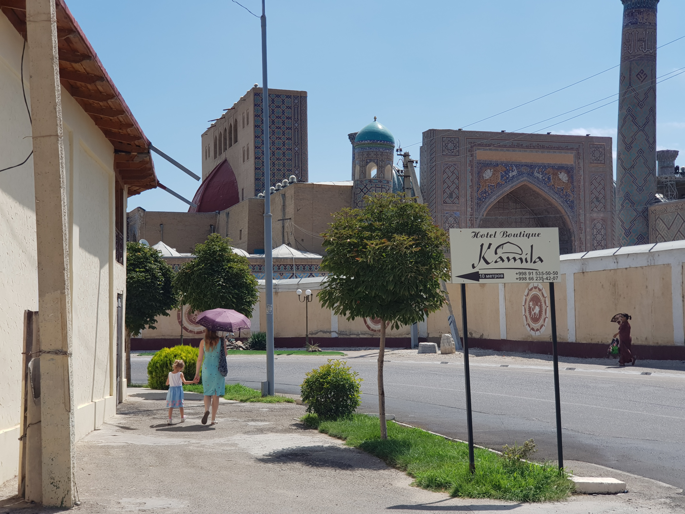

Особенность местного климата - сезонность почти идеально соответствует
календарю, переход между сезонами очень заметен. Самые райские месяцы здесь -
апрель, май, сентябрь, октябрь.

## Зима

 <label>Зима на Регистане</label>

Привычной зимы нет, среднесуточная температура зимних месяцев плюсовая. Длится
четко по календарю, с декабря по февраль. Снег даже если выпадает, то не лежит
больше нескольких дней. Погода переменчива. Иногда минус держится пару дней. А
через пару дней может прийти потепление до 20 градусов. Даже 27 °C когда-то
бывало. Местные пугают, что здесь +5 ощущаются как в Москве -15, но я такого не
почувствовал. По ощущениям, сравнимо с октябрем в средней полосе России.
Благодаря сухому воздуху и слабому ветру, ощущаемая температура не отличается от
фактической. Радует, что много солнечных дней. Из минусов - всплеск простудных
заболеваний. Иногда без ветра появляется дымка, особенно по ночам. В целом, не
самый приятный сезон, но вполне терпимо.

Но следует учитывать, что раз лет в 5 может внезапно случиться настоящая зима с
несколькими неделями без оттепели и ночными температурами за минус 20. Как это
случилось в начале 2023. Ни жители, ни коммунальщики к таким морозам не готовы.
В такую погоду перебои с электричеством, газом и водой случаются повсеместно.

 <label>Между зимой и весной</label>

## Весна

 <label>Ранняя весна</label>

Зима заканчивается достаточно резко в конце февраля. Зацветает урюк. Март очень
переменчивый и очень дождливый (по местным меркам) месяц. Тепло приходит
внезапно. Через неделю после последнего снега может быть под 30 градусов. Но
местные не расслабляются и ходят в куртках, погода коварная. В конце месяца
вылезает зелень. В начале апреля уже лето по российским меркам. Это самый
красивый месяц из-за обилия цветущих растений и деревьев. В мае уже не редкость
35 °C. Но здесь это самая приятная температура. В начале месяца живописно цветут
маковые поля.

 <label>Цветение маков в начале мая</label>

## Лето

Пугают, что летом здесь ад. Любят рассказывать про 60 градусную жару. В то-же
время 40° здесь сравнивают с 30° в Москве. На самом деле, абсолютный максимум 42
°C. Воздух летом очень сухой, поэтому жара переносится легко. Даже без
кондиционера норм, но это зависит от квартиры. Чилля (40 дней на фарси) это
период примерно с 25 июня по 3 августа. Самая жара именно в это время. 42 бывает
не каждый год, но 41 будет хотя бы несколько дней. Даже в это время, по моим
ощущениям, в городе приятно. Но в середине дня лучше избегать прямых солнечных
лучей. Спасает зонтик, но это больше дамский атрибут. Плюс климата Самарканда по
сравнению с Ташкентом или Бухарой - температура ниже на 3-5 градусов как
следствие высоты 720м над уровнем моря. Еще интересная особенность - абсолютно
ясное небо. Ни одной даже едва заметной тучки за несколько недель.

 <label>Летний зной</label>

## Осень

Как и другие сезоны, осень ярко выражена. В начале сентября температура опять
становится максимально приятной. Октябрь переменчив, ближе к концу уже может
быть прохладно. В ноябре уже никак без отопления.

 <label>Осень</label>
